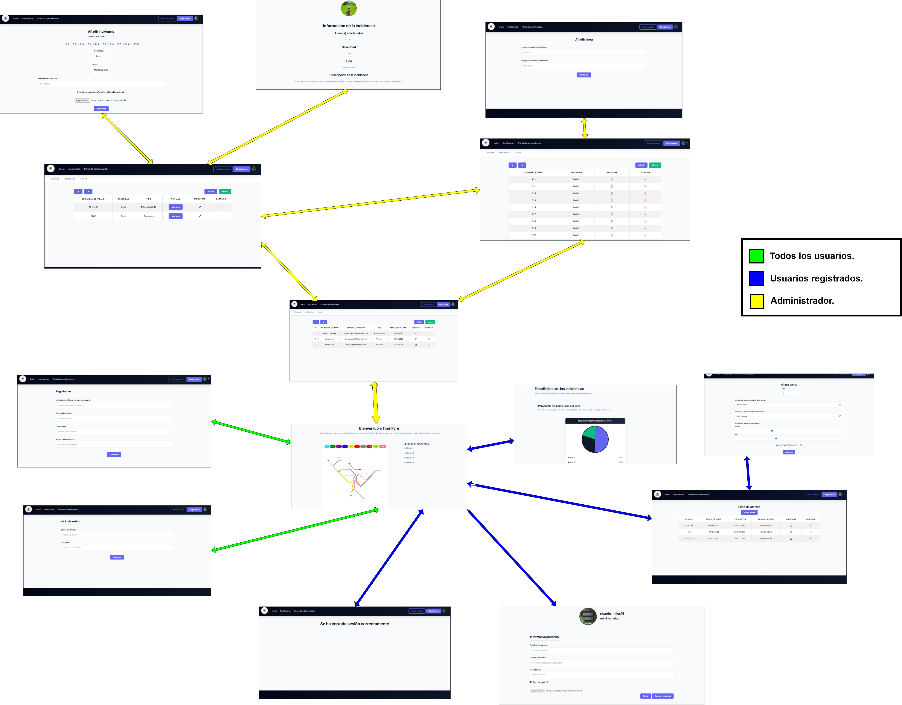
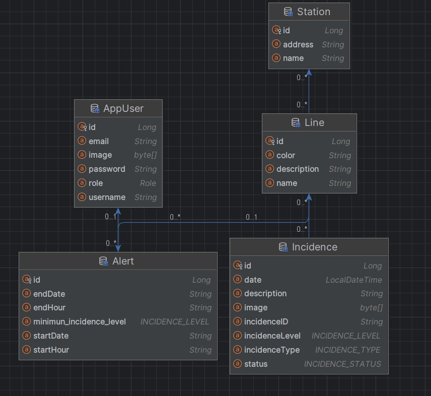

# TrainFyre

## 👥 Miembros del Equipo
| Nombre y Apellidos | Correo URJC | Usuario GitHub |
|:--- |:--- |:--- |
| Weisheng Zheng | w.zheng1.2023@alumnos.urjc.es | WeishengZheng |
| Alejandro González Blanco | a.gonzalezbl.2023@alumnos.urjc.es | alexgogb |
| Pablo Sainz López | p.sainz.2023@alumnos.urjc.es | Escipion48 (Pablo Sainz López) |
| Daniel Montes Jiménez | d.montes.2023@alumnos.urjc.es | ClaramenteYo (Posiblemente yo) |

---

## 🎭 **Preparación: Definición del Proyecto**

### **Descripción del Tema**
**Theme Description**
An advanced **Real-Time Railway Monitoring & Intelligence Platform** designed to centralize rail traffic data into a dynamic geospatial interface. The application enables users to visualize live train positions on an interactive map, audit historical performance by specific tracks, and analyze delay durations through custom time-range filters. It features a robust **automated notification engine** that delivers personalized status updates to registered users based on their frequent routes and schedules.

**Industry Sector**
*   **Smart Mobility & Transportation Tech:** Focused on urban infrastructure and logistics.
*   **SaaS (Software as a Service):** Providing specialized data visualization and alerting tools.

**Value Proposition**
*   **For Commuters:** Eliminates uncertainty by providing proactive alerts and live tracking, allowing for better time management and route planning.
*   **For Data Analysts:** Offers granular access to historical incident reports and track efficiency metrics to identify recurring bottlenecks.
*   **For Administrators:** Provides a centralized command center with **Role-Based Access Control (RBAC)** to manage system integrity and high-level operational data.

### **Entidades**

1.   **User:** Manages authentication and authorization. It stores profile details, account roles (Anonymous
 Vs. Standard vs. Administrator), and specific notification preferences, such as subscribed lines and time-window alerts.

2.   **Station:** Represents fixed geographic points along the network. These act as the connection nodes between tracks and serve as the reference points for schedules and user searches.

3.   **Line (Track/Segment):** Defines the physical or logical segments of the railway. It groups stations into specific routes and serves as the primary entity for categorizing location-based incidents.

4.   **Train:** Represents the active rolling stock units. It captures real-time data including current GPS coordinates, operational status, and its association with a specific scheduled trip.

5.   **Schedule (Timetable):** The backbone of the delay-tracking system. It stores the theoretical arrival and departure times for trains at various stations, allowing the system to calculate real-time deviations.

6.   **Incident:** Records any disruption in the service. It includes details such as the root cause, severity level, affected tracks, and the timestamp, enabling both real-time alerting and historical data analysis.

7.   **Alert Subscription:** Represents the specific monitoring criteria set by a user. It stores the parameters that trigger a notification, such as the target Line, a specific time window (start and end time), and the communication channel (e.g., Gmail). It acts as the bridge between the user's interests and the real-time incident engine.
  
**Relaciones entre entidades:**
*   **User — Alert Subscription (1:N):** Each user can manage multiple personalized subscriptions to track different routes and timeframes.

*   **Line — Station (N:M):** Lines are composed of several stations, and hubs (major stations) link multiple lines. This is managed via a junction entity that also defines the stop sequence.

*   **Line — Incident (N:M):** A single incident (e.g., infrastructure failure) can impact multiple lines simultaneously. Conversely, one line can suffer multiple incidents during a specific period.

*   **Line — Train (1:N):** A line serves as a container for all trains currently operating on that specific route.

*   **Train — Schedule (1:1):** Each active train is mapped to a specific trip in the timetable to calculate real-time performance and delays.

*   **Schedule — Station (N:1):** Theoretical arrival and departure records are anchored to specific stations.

*   **Alert Subscription — Line (N:1):** A subscription targets a specific line that the user wants to monitor within their preferred time window.

*   **Incident — Alert Subscription (N:M):** This is the logic engine; an incident triggers all subscriptions associated with the affected lines, provided the incident occurs within the user's specified time range.

### **Permisos de los Usuarios**

*   **Anonymous User:**
    -   **Permissions:** Can access the interactive map to view real-time train positions and active incidents. They can perform basic searches for specific lines and view public reliability charts.
    -   **Ownership:** None. This role has read-only access to public-facing data.

*   **Registered User:**
    -   **Permissions:** All Anonymous permissions plus the ability to manage their personal profile and create customized Alert Subscriptions. They can define specific time windows and lines to receive automated Gmail notifications.
    -   **Ownership:** Owns their **User Profile** data and their specific **Alert Subscriptions**. They have full CRUD (Create, Read, Update, Delete) rights over their own notification settings.

*   **Administrator:**
    -   **Permissions:** Complete system oversight. This includes managing (CRUD) the **Line** and **Station** database, validating or manually creating **Incidents** (to complement Renfe’s data), and full access to the Advanced Analytics Dashboard (KPIs, historical trends, and root cause analysis). They can also manage user accounts and system-wide configurations.
    -   **Ownership:** System-level entities such as **Lines**, **Stations**, and **Incidents**. They have the authority to manage or override any **Alert Subscription** or **User Profile** for moderation and system maintenance purposes.

### **Imágenes**

-   **User:** One profile image (avatar): Supports identity management and personalizes the user experience. It can be integrated via Google OAuth or uploaded directly to the user profile.

-   **Line:** One representative brand icon or logo per line: These assets are vital for the UI/UX, allowing users to quickly identify routes on the map and within the subscription dashboard through color coding and symbols.

-   **Incident:** Multiple optional images (gallery): Administrators have the capability to upload one or more photos as visual evidence of a disruption (e.g., technical failure, weather impact, or track maintenance). Being optional, it ensures that urgent alerts can still be published immediately even without visual media.

-   **Station:** One representative photo per station: Used to improve the visual context of the search results and to help users recognize the physical location of the stops.

### **Gráficos**

*   **Chart 1: Incident Distribution by Line and Time (Bar Chart):** 
    *   **Target Audience:** All users (Public/Registered).
    *   **Purpose:** To visualize which lines have been most affected by disruptions over the last specifies days. This helps users understand the current reliability of their frequent routes.

*   **Chart 2: Delay Duration Trends (Line Chart):** 
    *   **Target Audience:** Administrators.
    *   **Purpose:** To track the evolution of delay times (in minutes) over a specific period (daily, weekly, monthly, ...). It allows admins to identify if the network efficiency is improving or worsening over time.

*   **Chart 3: Incident Root Cause Distribution (Pie Chart):** 
    *   **Target Audience:** Administrators.
    *   **Purpose:** Categorizes incidents by their nature (e.g., Technical Failure, Weather, Human Error, Maintenance). This provides a quick visual breakdown of the primary sources of network instability.

*   **Chart 4: Peak Disruption Hours (Heatmap or Bar Chart):** 
    *   **Target Audience:** Administrators.
    *   **Purpose:** Displays the frequency of incidents across different time slots. Essential for identifying if most problems occur during rush hours, which is critical for operational planning.

### **Tecnología Complementaria**

-   **Advanced Geospatial Rendering (MapLibre GL JS):** Use of high-performance, WebGL-based vector maps to visualize the railway network. This allows for smooth interaction with complex line geometries and real-time marker updates for train positions.

-   **Railway Data Integration (Renfe/Adif Open Data):** Implementation of data pipelines to consume official API feeds from **Renfe Data**. This ensures the application operates with real-world schedules, station coordinates, and official line identifiers (GTFS/REST).

-   **Automated Notification Service (SMTP / Nodemailer):** A robust mailing engine to handle automated incident alerts. It processes the intersection between real-time service disruptions and user-defined subscription windows to deliver timely Gmail notifications.

-   **Real-Time State Management (WebSockets):** To maintain a persistent connection between the server and the front-end, ensuring that as soon as the Renfe Data feed updates an incident or a train's location, it is reflected on the user's map without delay.

### **Algoritmo o Consulta Avanzada**

**Algorithm: Real-Time Incident Propagation & Matching Engine**

**Description:**
Since the application consumes live incident feeds from **Renfe Data API**, the algorithm functions as a real-time data processor and distribution engine. It performs three critical steps:
1. **Data Normalization:** It parses the official Renfe feed (often unstructured or semi-structured) to extract specific affected `Lines`, `Severity`, and `Estimated Delay`.
2. **Conflict Matching:** It executes a complex search to match these external incidents with internal `User Subscriptions`. It filters by the intersection of the incident’s active duration and the user’s predefined time-window (e.g., matching a 10-minute delay on Line C-3 with a user subscribed between 08:00 and 09:00).
3. **Smart Notification Trigger:** It evaluates if the incident is "new" or an "update" to prevent sending multiple duplicate emails for the same ongoing delay, ensuring the user only receives relevant status changes.

**Alternative: Historical Reliability Index (HRI) Query**
A complex analytical query that aggregates the real-time data captured from Renfe over time. It calculates a "Reliability Score" per Line by comparing the total number of incidents vs. successful on-time arrivals within a specific timeframe (e.g., the last month). This allows administrators to see which sections of the infrastructure are consistently underperforming according to official data.

---

## 🛠 **Práctica 1: Maquetación de páginas web con HTML y CSS**

### **Diagrama de Navegación**
Diagrama que muestra cómo se navega entre las diferentes páginas de la aplicación:



> [Descripción opcional del flujo de navegación: Ej: "El usuario puede acceder desde la página principal a todas las secciones mediante el menú de navegación. Los usuarios anónimos solo tienen acceso a las páginas públicas, mientras que los registrados pueden acceder a su perfil y panel de usuario."]

### **Capturas de Pantalla y Descripción de Páginas**

#### **1. Página Principal / Home**


> [Descripción breve: Ej: "Página de inicio que muestra los productos destacados, categorías principales y un banner promocional. Incluye barra de navegación y acceso a registro/login para usuarios no autenticados."]

#### **AQUÍ AÑADIR EL RESTO DE PÁGINAS**

### **Participación de Miembros en la Práctica 1**

#### **Alumno 1 - [Nombre Completo]**

[Descripción de las tareas y responsabilidades principales del alumno en el proyecto]

| Nº    | Commits      | Files      |
|:------------: |:------------:| :------------:|
|1| [Descripción commit 1](URL_commit_1)  | [Archivo1](URL_archivo_1)   |
|2| [Descripción commit 2](URL_commit_2)  | [Archivo2](URL_archivo_2)   |
|3| [Descripción commit 3](URL_commit_3)  | [Archivo3](URL_archivo_3)   |
|4| [Descripción commit 4](URL_commit_4)  | [Archivo4](URL_archivo_4)   |
|5| [Descripción commit 5](URL_commit_5)  | [Archivo5](URL_archivo_5)   |

---

#### **Alumno 2 - [Nombre Completo]**

[Descripción de las tareas y responsabilidades principales del alumno en el proyecto]

| Nº    | Commits      | Files      |
|:------------: |:------------:| :------------:|
|1| [Descripción commit 1](URL_commit_1)  | [Archivo1](URL_archivo_1)   |
|2| [Descripción commit 2](URL_commit_2)  | [Archivo2](URL_archivo_2)   |
|3| [Descripción commit 3](URL_commit_3)  | [Archivo3](URL_archivo_3)   |
|4| [Descripción commit 4](URL_commit_4)  | [Archivo4](URL_archivo_4)   |
|5| [Descripción commit 5](URL_commit_5)  | [Archivo5](URL_archivo_5)   |

---

#### **Alumno 3 - [Nombre Completo]**

[Descripción de las tareas y responsabilidades principales del alumno en el proyecto]

| Nº    | Commits      | Files      |
|:------------: |:------------:| :------------:|
|1| [Descripción commit 1](URL_commit_1)  | [Archivo1](URL_archivo_1)   |
|2| [Descripción commit 2](URL_commit_2)  | [Archivo2](URL_archivo_2)   |
|3| [Descripción commit 3](URL_commit_3)  | [Archivo3](URL_archivo_3)   |
|4| [Descripción commit 4](URL_commit_4)  | [Archivo4](URL_archivo_4)   |
|5| [Descripción commit 5](URL_commit_5)  | [Archivo5](URL_archivo_5)   |

---

#### **Alumno 4 - [Nombre Completo]**

[Descripción de las tareas y responsabilidades principales del alumno en el proyecto]

| Nº    | Commits      | Files      |
|:------------: |:------------:| :------------:|
|1| [Descripción commit 1](URL_commit_1)  | [Archivo1](URL_archivo_1)   |
|2| [Descripción commit 2](URL_commit_2)  | [Archivo2](URL_archivo_2)   |
|3| [Descripción commit 3](URL_commit_3)  | [Archivo3](URL_archivo_3)   |
|4| [Descripción commit 4](URL_commit_4)  | [Archivo4](URL_archivo_4)   |
|5| [Descripción commit 5](URL_commit_5)  | [Archivo5](URL_archivo_5)   |

---

## 🛠 **Práctica 2: Web con HTML generado en servidor**

### **Navegación y Capturas de Pantalla**

#### **Diagrama de Navegación**

Solo si ha cambiado.

#### **Capturas de Pantalla Actualizadas**

Solo si han cambiado.

### **Instrucciones de Ejecución**

#### **Requisitos Previos**
- **Java**: versión 21 o superior
- **Maven**: versión 3.8 o superior
- **MySQL**: versión 8.0 o superior
- **Git**: para clonar el repositorio

#### **Pasos para ejecutar la aplicación**

1. **Clonar el repositorio**
   ```bash
   git clone https://github.com/[usuario]/[nombre-repositorio].git
   cd [nombre-repositorio]
   ```

2. **AQUÍ INDICAR LO SIGUIENTES PASOS**

#### **Credenciales de prueba**
- **Usuario Admin**: usuario: `admin`, contraseña: `admin`
- **Usuario Registrado**: usuario: `user`, contraseña: `user`

### **Diagrama de Entidades de Base de Datos**

Diagrama mostrando las entidades, sus campos y relaciones:



> [Descripción opcional: Ej: "El diagrama muestra las 4 entidades principales: Usuario, Producto, Pedido y Categoría, con sus respectivos atributos y relaciones 1:N y N:M."]

### **Diagrama de Clases y Templates**

Diagrama de clases de la aplicación con diferenciación por colores o secciones:


> [Descripción opcional del diagrama y relaciones principales]

### **Participación de Miembros en la Práctica 2**

#### **Alumno 1 - [Nombre Completo]**

[Descripción de las tareas y responsabilidades principales del alumno en el proyecto]

| Nº    | Commits      | Files      |
|:------------: |:------------:| :------------:|
|1| [Descripción commit 1](URL_commit_1)  | [Archivo1](URL_archivo_1)   |
|2| [Descripción commit 2](URL_commit_2)  | [Archivo2](URL_archivo_2)   |
|3| [Descripción commit 3](URL_commit_3)  | [Archivo3](URL_archivo_3)   |
|4| [Descripción commit 4](URL_commit_4)  | [Archivo4](URL_archivo_4)   |
|5| [Descripción commit 5](URL_commit_5)  | [Archivo5](URL_archivo_5)   |

---

#### **Alumno 2 - [Nombre Completo]**

[Descripción de las tareas y responsabilidades principales del alumno en el proyecto]

| Nº    | Commits      | Files      |
|:------------: |:------------:| :------------:|
|1| [Descripción commit 1](URL_commit_1)  | [Archivo1](URL_archivo_1)   |
|2| [Descripción commit 2](URL_commit_2)  | [Archivo2](URL_archivo_2)   |
|3| [Descripción commit 3](URL_commit_3)  | [Archivo3](URL_archivo_3)   |
|4| [Descripción commit 4](URL_commit_4)  | [Archivo4](URL_archivo_4)   |
|5| [Descripción commit 5](URL_commit_5)  | [Archivo5](URL_archivo_5)   |

---

#### **Alumno 3 - [Nombre Completo]**

[Descripción de las tareas y responsabilidades principales del alumno en el proyecto]

| Nº    | Commits      | Files      |
|:------------: |:------------:| :------------:|
|1| [Descripción commit 1](URL_commit_1)  | [Archivo1](URL_archivo_1)   |
|2| [Descripción commit 2](URL_commit_2)  | [Archivo2](URL_archivo_2)   |
|3| [Descripción commit 3](URL_commit_3)  | [Archivo3](URL_archivo_3)   |
|4| [Descripción commit 4](URL_commit_4)  | [Archivo4](URL_archivo_4)   |
|5| [Descripción commit 5](URL_commit_5)  | [Archivo5](URL_archivo_5)   |

---

#### **Alumno 4 - [Nombre Completo]**

[Descripción de las tareas y responsabilidades principales del alumno en el proyecto]

| Nº    | Commits      | Files      |
|:------------: |:------------:| :------------:|
|1| [Descripción commit 1](URL_commit_1)  | [Archivo1](URL_archivo_1)   |
|2| [Descripción commit 2](URL_commit_2)  | [Archivo2](URL_archivo_2)   |
|3| [Descripción commit 3](URL_commit_3)  | [Archivo3](URL_archivo_3)   |
|4| [Descripción commit 4](URL_commit_4)  | [Archivo4](URL_archivo_4)   |
|5| [Descripción commit 5](URL_commit_5)  | [Archivo5](URL_archivo_5)   |

---

## 🛠 **Práctica 3: API REST, docker y despliegue**

### **Documentación de la API REST**

#### **Especificación OpenAPI**
📄 **[Especificación OpenAPI (YAML)](/api-docs/api-docs.yaml)**

#### **Documentación HTML**
📖 **[Documentación API REST (HTML)](https://raw.githack.com/[usuario]/[repositorio]/main/api-docs/api-docs.html)**

> La documentación de la API REST se encuentra en la carpeta `/api-docs` del repositorio. Se ha generado automáticamente con SpringDoc a partir de las anotaciones en el código Java.

### **Diagrama de Clases y Templates Actualizado**

Diagrama actualizado incluyendo los @RestController y su relación con los @Service compartidos:


### **Instrucciones de Ejecución con Docker**

#### **Requisitos previos:**
- Docker instalado (versión 20.10 o superior)
- Docker Compose instalado (versión 2.0 o superior)

#### **Pasos para ejecutar con docker-compose:**

1. **Clonar el repositorio** (si no lo has hecho ya):
   ```bash
   git clone https://github.com/[usuario]/[repositorio].git
   cd [repositorio]
   ```

2. **AQUÍ LOS SIGUIENTES PASOS**:

### **Construcción de la Imagen Docker**

#### **Requisitos:**
- Docker instalado en el sistema

#### **Pasos para construir y publicar la imagen:**

1. **Navegar al directorio de Docker**:
   ```bash
   cd docker
   ```

2. **AQUÍ LOS SIGUIENTES PASOS**

### **Despliegue en Máquina Virtual**

#### **Requisitos:**
- Acceso a la máquina virtual (SSH)
- Clave privada para autenticación
- Conexión a la red correspondiente o VPN configurada

#### **Pasos para desplegar:**

1. **Conectar a la máquina virtual**:
   ```bash
   ssh -i [ruta/a/clave.key] [usuario]@[IP-o-dominio-VM]
   ```
   
   Ejemplo:
   ```bash
   ssh -i ssh-keys/app.key vmuser@10.100.139.XXX
   ```

2. **AQUÍ LOS SIGUIENTES PASOS**:

### **URL de la Aplicación Desplegada**

🌐 **URL de acceso**: `https://[nombre-app].etsii.urjc.es:8443`

#### **Credenciales de Usuarios de Ejemplo**

| Rol | Usuario | Contraseña |
|:---|:---|:---|
| Administrador | admin | admin123 |
| Usuario Registrado | user1 | user123 |
| Usuario Registrado | user2 | user123 |

### **OTRA DOCUMENTACIÓN ADICIONAL REQUERIDA EN LA PRÁCTICA**

### **Participación de Miembros en la Práctica 3**

#### **Alumno 1 - [Nombre Completo]**

[Descripción de las tareas y responsabilidades principales del alumno en el proyecto]

| Nº    | Commits      | Files      |
|:------------: |:------------:| :------------:|
|1| [Descripción commit 1](URL_commit_1)  | [Archivo1](URL_archivo_1)   |
|2| [Descripción commit 2](URL_commit_2)  | [Archivo2](URL_archivo_2)   |
|3| [Descripción commit 3](URL_commit_3)  | [Archivo3](URL_archivo_3)   |
|4| [Descripción commit 4](URL_commit_4)  | [Archivo4](URL_archivo_4)   |
|5| [Descripción commit 5](URL_commit_5)  | [Archivo5](URL_archivo_5)   |

---

#### **Alumno 2 - [Nombre Completo]**

[Descripción de las tareas y responsabilidades principales del alumno en el proyecto]

| Nº    | Commits      | Files      |
|:------------: |:------------:| :------------:|
|1| [Descripción commit 1](URL_commit_1)  | [Archivo1](URL_archivo_1)   |
|2| [Descripción commit 2](URL_commit_2)  | [Archivo2](URL_archivo_2)   |
|3| [Descripción commit 3](URL_commit_3)  | [Archivo3](URL_archivo_3)   |
|4| [Descripción commit 4](URL_commit_4)  | [Archivo4](URL_archivo_4)   |
|5| [Descripción commit 5](URL_commit_5)  | [Archivo5](URL_archivo_5)   |

---

#### **Alumno 3 - [Nombre Completo]**

[Descripción de las tareas y responsabilidades principales del alumno en el proyecto]

| Nº    | Commits      | Files      |
|:------------: |:------------:| :------------:|
|1| [Descripción commit 1](URL_commit_1)  | [Archivo1](URL_archivo_1)   |
|2| [Descripción commit 2](URL_commit_2)  | [Archivo2](URL_archivo_2)   |
|3| [Descripción commit 3](URL_commit_3)  | [Archivo3](URL_archivo_3)   |
|4| [Descripción commit 4](URL_commit_4)  | [Archivo4](URL_archivo_4)   |
|5| [Descripción commit 5](URL_commit_5)  | [Archivo5](URL_archivo_5)   |

---

#### **Alumno 4 - [Nombre Completo]**

[Descripción de las tareas y responsabilidades principales del alumno en el proyecto]

| Nº    | Commits      | Files      |
|:------------: |:------------:| :------------:|
|1| [Descripción commit 1](URL_commit_1)  | [Archivo1](URL_archivo_1)   |
|2| [Descripción commit 2](URL_commit_2)  | [Archivo2](URL_archivo_2)   |
|3| [Descripción commit 3](URL_commit_3)  | [Archivo3](URL_archivo_3)   |
|4| [Descripción commit 4](URL_commit_4)  | [Archivo4](URL_archivo_4)   |
|5| [Descripción commit 5](URL_commit_5)  | [Archivo5](URL_archivo_5)   |

---
