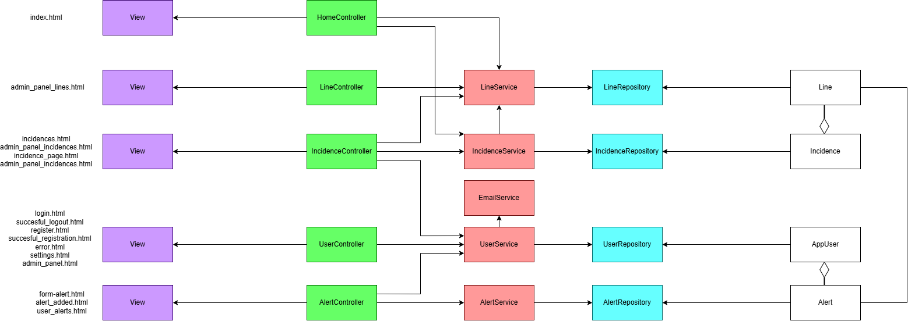

# TrainFyre

## 👥 Miembros del Equipo
| Nombre y Apellidos | Correo URJC | Usuario GitHub |
|:--- |:--- |:--- |
| Weisheng Zheng | w.zheng1.2023@alumnos.urjc.es | WeishengZheng |
| Alejandro González Blanco | a.gonzalezbl.2023@alumnos.urjc.es | alexgogb |
| Pablo Sainz López | p.sainz.2023@alumnos.urjc.es | Escipion48 (Pablo Sainz López) |
| Daniel Montes Jiménez | d.montes.2023@alumnos.urjc.es | ClaramenteYo (Posiblemente yo) |

---

## 🎭 **Preparación: Definición del Proyecto**

### **Descripción del Tema**
**Theme Description**
An advanced **Real-Time Railway Monitoring & Intelligence Platform** designed to centralize rail traffic data into a dynamic geospatial interface. The application enables users to visualize live train positions on an interactive map, audit historical performance by specific tracks, and analyze delay durations through custom time-range filters. It features a robust **automated notification engine** that delivers personalized status updates to registered users based on their frequent routes and schedules.

**Industry Sector**
*   **Smart Mobility & Transportation Tech:** Focused on urban infrastructure and logistics.
*   **SaaS (Software as a Service):** Providing specialized data visualization and alerting tools.

**Value Proposition**
*   **For Commuters:** Eliminates uncertainty by providing proactive alerts and live tracking, allowing for better time management and route planning.
*   **For Data Analysts:** Offers granular access to historical incident reports and track efficiency metrics to identify recurring bottlenecks.
*   **For Administrators:** Provides a centralized command center with **Role-Based Access Control (RBAC)** to manage system integrity and high-level operational data.

### **Entidades**
*This may change in the future as the project progresses, this is only the first aproach, however we will try to follow it as much as possible*

1.   **User:** Manages authentication and authorization. It stores profile details, account roles (Anonymous
 Vs. Standard vs. Administrator), and specific notification preferences, such as subscribed lines and time-window alerts.

2.   **Station:** Represents fixed geographic points along the network. These act as the connection nodes between tracks and serve as the reference points for schedules and user searches.

3.   **Line (Track/Segment):** Defines the physical or logical segments of the railway. It groups stations into specific routes and serves as the primary entity for categorizing location-based incidents.

4.   **Incidence:** Records any disruption in the service. It includes details such as the root cause, severity level, affected tracks, and the timestamp, enabling both real-time alerting and historical data analysis.

5.   **Alert Subscription:** Represents the specific monitoring criteria set by a user. It stores the parameters that trigger a notification, such as the target Line, a specific time window (start and end time), and the communication channel (e.g., Gmail). It acts as the bridge between the user's interests and the real-time incident engine.
  
**Relaciones entre entidades:**

*This may change in the future as the project progresses, this is only the first aproach, however we will try to follow it as much as possible*

*   **User — Alert Subscription (1:N):** Each user can manage multiple personalized subscriptions to track different routes and timeframes.

*   **Line — Station (N:M):** Lines are composed of several stations, and hubs (major stations) link multiple lines. This is managed via a junction entity that also defines the stop sequence.

*   **Line — Incident (N:M):** A single incident (e.g., infrastructure failure) can impact multiple lines simultaneously. Conversely, one line can suffer multiple incidents during a specific period.

*   **Alert Subscription — Line (N:1):** A subscription targets a specific line that the user wants to monitor within their preferred time window.

*   **Incident — Alert Subscription (N:M):** This is the logic engine; an incident triggers all subscriptions associated with the affected lines, provided the incident occurs within the user's specified time range.

### **Permisos de los Usuarios**
*This may change in the future as the project progresses, this is only the first aproach, however we will try to follow it as much as possible*

*   **Anonymous User:**
    -   **Permissions:** Can access the interactive map to view real-time train positions and active incidents. They can perform basic searches for specific lines and view public reliability charts.
    -   **Ownership:** None. This role has read-only access to public-facing data.

*   **Registered User:**
    -   **Permissions:** All Anonymous permissions plus the ability to manage their personal profile and create customized Alert Subscriptions. They can define specific time windows and lines to receive automated Gmail notifications.
    -   **Ownership:** Owns their **User Profile** data and their specific **Alert Subscriptions**. They have full CRUD (Create, Read, Update, Delete) rights over their own notification settings.

*   **Administrator:**
    -   **Permissions:** Complete system oversight. This includes managing (CRUD) the **Line** and **Station** database, validating or manually creating **Incidents** (to complement Renfe’s data), and full access to the Advanced Analytics Dashboard (KPIs, historical trends, and root cause analysis). They can also manage user accounts and system-wide configurations.
    -   **Ownership:** System-level entities such as **Lines**, **Stations**, and **Incidents**. They have the authority to manage or override any **Alert Subscription** or **User Profile** for moderation and system maintenance purposes.

### **Imágenes**
*This may change in the future as the project progresses, this is only the first aproach, however we will try to follow it as much as possible*

-   **User:** One profile image (avatar): Supports identity management and personalizes the user experience. It can be integrated via Google OAuth or uploaded directly to the user profile.

-   **Line:** One representative brand icon or logo per line: These assets are vital for the UI/UX, allowing users to quickly identify routes on the map and within the subscription dashboard through color coding and symbols.

-   **Incident:** Multiple optional images (gallery): Administrators have the capability to upload one or more photos as visual evidence of a disruption (e.g., technical failure, weather impact, or track maintenance). Being optional, it ensures that urgent alerts can still be published immediately even without visual media.

-   **Station:** One representative photo per station: Used to improve the visual context of the search results and to help users recognize the physical location of the stops.

### **Gráficos**
*This may change in the future as the project progresses, this is only the first aproach, however we will try to follow it as much as possible*

*   **Chart 1: Incident Distribution by Line and Time (Bar Chart):** 
    *   **Target Audience:** All users (Public/Registered).
    *   **Purpose:** To visualize which lines have been most affected by disruptions over the last specifies days. This helps users understand the current reliability of their frequent routes.

*   **Chart 2: Delay Duration Trends (Line Chart):** 
    *   **Target Audience:** Administrators.
    *   **Purpose:** To track the evolution of delay times (in minutes) over a specific period (daily, weekly, monthly, ...). It allows admins to identify if the network efficiency is improving or worsening over time.

*   **Chart 3: Incident Root Cause Distribution (Pie Chart):** 
    *   **Target Audience:** Administrators.
    *   **Purpose:** Categorizes incidents by their nature (e.g., Technical Failure, Weather, Human Error, Maintenance). This provides a quick visual breakdown of the primary sources of network instability.

*   **Chart 4: Peak Disruption Hours (Heatmap or Bar Chart):** 
    *   **Target Audience:** Administrators.
    *   **Purpose:** Displays the frequency of incidents across different time slots. Essential for identifying if most problems occur during rush hours, which is critical for operational planning.

### **Tecnología Complementaria**
*This may change in the future as the project progresses, this is only the first aproach, however we will try to follow it as much as possible*

-   **Advanced Geospatial Rendering (MapLibre GL JS):** Use of high-performance, WebGL-based vector maps to visualize the railway network. This allows for smooth interaction with complex line geometries and real-time marker updates for train positions.

-   **Railway Data Integration (Renfe/Adif Open Data):** Implementation of data pipelines to consume official API feeds from **Renfe Data**. This ensures the application operates with real-world schedules, station coordinates, and official line identifiers (GTFS/REST).

-   **Automated Notification Service (SMTP / Nodemailer):** A robust mailing engine to handle automated incident alerts. It processes the intersection between real-time service disruptions and user-defined subscription windows to deliver timely Gmail notifications.

-   **Real-Time State Management (WebSockets):** To maintain a persistent connection between the server and the front-end, ensuring that as soon as the Renfe Data feed updates an incident or a train's location, it is reflected on the user's map without delay.

### **Algoritmo o Consulta Avanzada**
*This may change in the future as the project progresses, this is only the first aproach, however we will try to follow it as much as possible*

**Algorithm: Real-Time Incident Propagation & Matching Engine**

**Description:**
Since the application consumes live incident feeds from **Renfe Data API**, the algorithm functions as a real-time data processor and distribution engine. It performs three critical steps:
1. **Data Normalization:** It parses the official Renfe feed (often unstructured or semi-structured) to extract specific affected `Lines`, `Severity`, and `Estimated Delay`.
2. **Conflict Matching:** It executes a complex search to match these external incidents with internal `User Subscriptions`. It filters by the intersection of the incident’s active duration and the user’s predefined time-window (e.g., matching a 10-minute delay on Line C-3 with a user subscribed between 08:00 and 09:00).
3. **Smart Notification Trigger:** It evaluates if the incident is "new" or an "update" to prevent sending multiple duplicate emails for the same ongoing delay, ensuring the user only receives relevant status changes.

**Alternative: Historical Reliability Index (HRI) Query**
A complex analytical query that aggregates the real-time data captured from Renfe over time. It calculates a "Reliability Score" per Line by comparing the total number of incidents vs. successful on-time arrivals within a specific timeframe (e.g., the last month). This allows administrators to see which sections of the infrastructure are consistently underperforming according to official data.

---

## 🛠 **Práctica 1: Maquetación de páginas web con HTML y CSS**

### **Diagrama de Navegación**
Diagrama que muestra cómo se navega entre las diferentes páginas de la aplicación:


Unregistered users can visualize the index page, which contains an interactive map and last incidences. Additionally, they can visit the log in and register pages. Registered users can access the statistics page, their settings and their personal alert page. Administrators can access the admin panel to add, modify and remove incidences, users and lines.

### **Capturas de Pantalla y Descripción de Páginas**

#### **1. Main page / Index**


> Main page to see the last incidences in any line using an intuitive map.

#### **2. Register form**


> Form to create an account for a new user.

#### **3. Login form**


> Form to let users log in with their data and password.

#### **4. Alert table**


> Table with the alerts set by the user and the option to create new ones, as well as modify existing ones.

#### **5. Alert form**


> Form to let users define new alerts by their starting and ending dates, as well as their timetable.

#### **6. User settings**


> Page with the user's data and the option to change it.

#### **7. Session ended**


> Confirmation of a successful logout.

#### **8. Incidence statistics**


> Page with different graphs to show valuable information about the incidences.

#### **9. Administrator table - Users**


> Table with the users and their information, as well as the option to modify or remove them.

#### **10. Administrator table - Incidences**


> Table with the incidences and their information, as well as the option to modify, create or remove them.

#### **11. Administrator table - Lines**


> Table with the lines and their information, as well as the option to modify, create or remove them.

#### **12. Incidence form**


> Form to create new incidences with the affected lines, a description and more information.

#### **13. Line form**


> Form to create new lines with their name and location.

#### **14. Incidence information**


> Page with extended information about an incidence.

#### **Extra 1. Header**


> Header present in every page.

#### **Extra 2. Footer**


> Footer present in every page.

### **Participación de Miembros en la Práctica 1**

#### **Alumno 1 - [Weisheng Zheng]**

| Nº    | Commits      | Files      |
|:------------: |:------------:| :------------:|
|1| [Lógica JavaScript para el mapa interactivo](https://github.com/CodeURJC-SSDD-2025-26/practica-ssdd-2025-26-grupo-1/commit/6aad309d67bf9040ecc62cef8fd93e9dca53a5e2)  | [interactive-map.js](https://github.com/CodeURJC-SSDD-2025-26/practica-ssdd-2025-26-grupo-1/blob/fc34148b30c20c3b2da0ba677c2b57829c4c46d8/TrainFyre/src/main/resources/js/components/interactive-map.js)   |
|2| [Lógica JavaScript del heatmap implementado](https://github.com/CodeURJC-SSDD-2025-26/practica-ssdd-2025-26-grupo-1/commit/fd69ce32604245e9a60c681669748bc8ffa9de77)  | [heatmap.js](https://github.com/CodeURJC-SSDD-2025-26/practica-ssdd-2025-26-grupo-1/blob/fc34148b30c20c3b2da0ba677c2b57829c4c46d8/TrainFyre/src/main/resources/js/components/heatmap.js)   |
|3| [Implementación de la página index](https://github.com/CodeURJC-SSDD-2025-26/practica-ssdd-2025-26-grupo-1/commit/100c4152b7ec25e36efe1826f2928c2b697b27d9)  | [index.html](https://github.com/CodeURJC-SSDD-2025-26/practica-ssdd-2025-26-grupo-1/blob/fc34148b30c20c3b2da0ba677c2b57829c4c46d8/TrainFyre/src/main/resources/templates/index.html)   |
|4| [Implementación pop-up partial](https://github.com/CodeURJC-SSDD-2025-26/practica-ssdd-2025-26-grupo-1/commit/d0000f5c50de222387d6d9dfa152f9bfc0a0b171)  | [_pop_up.html](https://github.com/CodeURJC-SSDD-2025-26/practica-ssdd-2025-26-grupo-1/blob/fc34148b30c20c3b2da0ba677c2b57829c4c46d8/TrainFyre/src/main/resources/templates/partials/_pop_up.html)   |
|5| [Creación de mapa de Cercanías SVG](https://github.com/CodeURJC-SSDD-2025-26/practica-ssdd-2025-26-grupo-1/commit/5970597215174c4f1acec276bb352f05db6437a7)  | [_interactive_map.html](https://github.com/CodeURJC-SSDD-2025-26/practica-ssdd-2025-26-grupo-1/blob/fc34148b30c20c3b2da0ba677c2b57829c4c46d8/TrainFyre/src/main/resources/templates/partials/_interactive_map.html)   |

---

#### **Alumno 2 - [Alejandro González Blanco]**

| Nº    | Commits      | Files      |
|:------------: |:------------:| :------------:|
|1| [En este commit creé el header.](https://github.com/CodeURJC-SSDD-2025-26/ssdd-2025-26-project-base/commit/a190e28ee9f6cdb5b3fcdb773283b6b48a43d807)  | [_header.html](https://github.com/CodeURJC-SSDD-2025-26/practica-ssdd-2025-26-grupo-1/blob/main/TrainFyre/src/main/resources/templates/partials/_header.html)   |
|2| [En este commit creé la configuración.](https://github.com/CodeURJC-SSDD-2025-26/ssdd-2025-26-project-base/commit/6a4da71396adb1b3d0123c76da7e2c2800b40b79)  | [settings.html](https://github.com/CodeURJC-SSDD-2025-26/practica-ssdd-2025-26-grupo-1/blob/main/TrainFyre/src/main/resources/templates/settings.html)   |
|3| [En este commit creé el panel de administrador.](https://github.com/CodeURJC-SSDD-2025-26/ssdd-2025-26-project-base/commit/7ff88c29c7fafcf64a26baf17a313d5ef288f63e)  | [admin_panel.html](https://github.com/CodeURJC-SSDD-2025-26/practica-ssdd-2025-26-grupo-1/blob/main/TrainFyre/src/main/resources/templates/admin_panel.html)   |
|4| [En este commit creé el JS para activar o desactivar la configuración.](https://github.com/CodeURJC-SSDD-2025-26/ssdd-2025-26-project-base/commit/eff1077e5052e0b169066a94a41390a9d8433a24)  | [change-settings.js](https://github.com/CodeURJC-SSDD-2025-26/practica-ssdd-2025-26-grupo-1/blob/main/TrainFyre/src/main/resources/js/components/change-settings.js)   |
|5| [En este commit creé el subheader.](https://github.com/CodeURJC-SSDD-2025-26/ssdd-2025-26-project-base/commit/75880dec3f724931aeb25f75b51750cedbc21e9c)  | [_subheader.html](https://github.com/CodeURJC-SSDD-2025-26/practica-ssdd-2025-26-grupo-1/blob/main/TrainFyre/src/main/resources/templates/partials/_subheader.html)   |

---
Mis demás commits son arreglando cosas en otros archivos y mejorando el estilo.

#### **Alumno 3 - [Pablo Sainz López]**

Plantear y establecer la estructura del proyecto. Mirar comprobar y mejorar la calidad del código además de crear las paginas y partials correspondientes.

| Nº    | Commits      | Files      |
|:------------: |:------------:| :------------:|
|1| [Creé el footer y dos partials para mostrar datos](https://github.com/CodeURJC-SSDD-2025-26/ssdd-2025-26-project-base/commit/a8ddbda5bff10326f19160e985c6c81a246cc0cd)  | [footer](https://github.com/CodeURJC-SSDD-2025-26/practica-ssdd-2025-26-grupo-1/blob/main/TrainFyre/src/main/resources/templates/partials/_footer.html) [grafico de barras](https://github.com/CodeURJC-SSDD-2025-26/practica-ssdd-2025-26-grupo-1/blob/main/TrainFyre/src/main/resources/templates/partials/_bar_graph.html) [grafico tarta](https://github.com/CodeURJC-SSDD-2025-26/practica-ssdd-2025-26-grupo-1/blob/main/TrainFyre/src/main/resources/templates/partials/_pie_graph.html)  |
|2| [Creé la página de incidencias](https://github.com/CodeURJC-SSDD-2025-26/ssdd-2025-26-project-base/commit/c880ee0af238c3004853853d9ed03a523c7d69aa)  | [Incidencias](https://github.com/CodeURJC-SSDD-2025-26/practica-ssdd-2025-26-grupo-1/blob/main/TrainFyre/src/main/resources/templates/incidencies.html)   |
|3| [Creé el código js para cargar páginas y partials de forma automática y estandarizada y reorganicé el proyecto en sucesivos comits](https://github.com/CodeURJC-SSDD-2025-26/ssdd-2025-26-project-base/commit/d51fff9a6d2b687896edab73e6d360c4249d0faf)  | [Cargador genérico](https://github.com/CodeURJC-SSDD-2025-26/practica-ssdd-2025-26-grupo-1/blob/main/TrainFyre/src/main/resources/js/utils/genericPartialLoader.js)   |
|4| [Arreglé el mapa interactivo y mejoré su código](https://github.com/CodeURJC-SSDD-2025-26/ssdd-2025-26-project-base/commit/a462ef17ec78ca5211cd96439e4b2af6733b77b5)  | [Js del mapa](https://github.com/CodeURJC-SSDD-2025-26/practica-ssdd-2025-26-grupo-1/blob/main/TrainFyre/src/main/resources/js/components/interactive-map.js)|
|5| [Creé el CSS para empezar a trabajar con un CSS común](https://github.com/CodeURJC-SSDD-2025-26/ssdd-2025-26-project-base/commit/3cd0949ed2f928d70e86a872e63d6712e1cdca60)  | [CSS](https://github.com/CodeURJC-SSDD-2025-26/practica-ssdd-2025-26-grupo-1/blob/main/TrainFyre/src/main/resources/static/css/style.css)   |

---

#### **Alumno 4 - Daniel Montes Jiménez**

Responsible for every form and table (except for the users table and the settings page), as well as the script used in the alert form to link the sliders with the time imputs. This script also prevents impossible time ranges (for example, from 6:00 to 3:00). 

| Nº    | Commits      | Files      |
|:------------: |:------------:| :------------:|
|1| [Added javascript with the logic for the future slider in the alert form.](https://github.com/CodeURJC-SSDD-2025-26/ssdd-2025-26-project-base/commit/88f86f763a0f8f6e1999b671aa6f845cd240c51f) 88f86f763a0f8f6e1999b671aa6f845cd240c51f  | [Script for the sliders](https://github.com/CodeURJC-SSDD-2025-26/ssdd-2025-26-project-base/commit/88f86f763a0f8f6e1999b671aa6f845cd240c51f#diff-dc117f66b6191f28f4718305eab6a599d23f2f19c7c9e5e3be6f4dda50fef165)   |
|2| [Added a new table to show your alerts and modify them.](https://github.com/CodeURJC-SSDD-2025-26/ssdd-2025-26-project-base/commit/0714c887ca4caddf7ea4bc87ffca7b5c69cf96a4) 0714c887ca4caddf7ea4bc87ffca7b5c69cf96a4  | [Tabla de alertas](https://github.com/CodeURJC-SSDD-2025-26/ssdd-2025-26-project-base/commit/0714c887ca4caddf7ea4bc87ffca7b5c69cf96a4#diff-1c7f9094d31a03777ba6db5f1429727dd9f97f17da81565e64ba28ffd4e8ba74)   |
|3| [Made the admin table change tables when pressing their respective buttons.](https://github.com/CodeURJC-SSDD-2025-26/ssdd-2025-26-project-base/commit/876476fe435b8b4184544539cf3c97a8baaae963) 876476fe435b8b4184544539cf3c97a8baaae963  | [Incidence table](https://github.com/CodeURJC-SSDD-2025-26/ssdd-2025-26-project-base/commit/876476fe435b8b4184544539cf3c97a8baaae963#diff-336a8c7130c9afc1a303fb0cbd04347c2c38118dd688b449b2e2b9d6156a290c) [Tabla de líneas](https://github.com/CodeURJC-SSDD-2025-26/ssdd-2025-26-project-base/commit/876476fe435b8b4184544539cf3c97a8baaae963#diff-859a1f6c0feb102b3d41c912ac70ab5fc693cde7c33a2b77badf7d27a2df682e)  |
|4| [Added a form for incidences.](https://github.com/CodeURJC-SSDD-2025-26/ssdd-2025-26-project-base/commit/e92e047d296a22caaf5677a2e7051f41b49ce26a) e92e047d296a22caaf5677a2e7051f41b49ce26a  | [Incidence form](https://github.com/CodeURJC-SSDD-2025-26/ssdd-2025-26-project-base/commit/e92e047d296a22caaf5677a2e7051f41b49ce26a#diff-70fec7aa0d301d5bad4248e395e152fe319430452e812e1c1c4ae70df7b6e657)   |
|5| [Added a template for the login form.](https://github.com/CodeURJC-SSDD-2025-26/ssdd-2025-26-project-base/commit/3feabe72a0912ac7a105e4bd0589b2093a987cba) 3feabe72a0912ac7a105e4bd0589b2093a987cba  | [Login form template](https://github.com/CodeURJC-SSDD-2025-26/ssdd-2025-26-project-base/commit/3feabe72a0912ac7a105e4bd0589b2093a987cba#diff-84c6d7f18eead306434a8b039abeda0e602e23c7be107ebc21d6b9a35e65a771)   |

---

## 🛠 **Práctica 2: Web con HTML generado en servidor**

### **Navegación y Capturas de Pantalla**

#### **Diagrama de Navegación**

Solo añadidas pantallas confirmando la adición de elementos.

#### **Capturas de Pantalla Actualizadas**

Se sigue aplicando el diagrama de la práctica anterior.

### **Instrucciones de Ejecución**

#### **Requisitos Previos**
- **Java**: versión 21 o superior
- **Maven**: versión 4.0 o superior
- **MySQL**: Ninguna, está embebida (H2)
- **Git**: para clonar el repositorio
- **Lombok**
- **MapStruct**


#### **Pasos para ejecutar la aplicación**
>[!CAUTION]
> Actualmente no me ha dado tiempo a probarlo, podria estar mal alguno de los pasos
1. **Clonar el repositorio**
   ```bash
   git https://github.com/CodeURJC-SSDD-2025-26/practica-ssdd-2025-26-grupo-1.git
   cd practica-ssdd-2025-26-grupo-1
   ```
2. **Verificar versión de Java**
    ```bash
   java -version
   ```
3. **Compilar e instalar las dependencias**
    ```bash
   mvn clean install
   ```
4. **Ejecutar la aplicación**
    
    La aplicación se puede lanzar directamente con la 
    configuración predeterminada, como:
    ```bash
   mvn spring-boot:run
   ```
   También existen perfiles para lanzarse en distintas configuraciones, más información más abajo, para lanzar perfiles específicos:
    ```bash
   mvn spring-boot:run -Dspring-boot.run.profiles=[perfil]
   ```
5. **Acceso a la aplicación**  
    Acceder mediante el navegador ingresando: https://localhost:8443/

#### Perfiles de la aplicación y sus funcionalidades/info
La aplicación tiene varios archivos yml para tener varios 
perfiles y posteriormente poder separar configuraciones y o 
activar/desactivar servicios, dependencias etc.
Aunque evidentemente se cuenta con un application.yml para configuraciones comunes.

**Perfiles**:
* prod: perfil preparado para produccion (despligue de la app),
    actualmente solo desactiva la base de datos H2
* dev: perfil preparado para desarrollo y pruebas, cargará un banner.txt distinto
    como confirmación visual. (Anteriormente creaba además un usuario, __deprecated__)
* mail: activa las notificaciones por mail (smtp), es necesario pasar un 
    gmail y una contraseña (no usar la contraseña normal del correo, utilizar
  una contraseña de aplicación, más info en: https://support.google.com/mail/answer/185833?hl=es) 
  Estos valores se pasaran como variables de entorno con los nombres: MAIL_USERNAME y MAIL_PASSWORD respectivamente
  . Estas variables deberian de tomar los valores NO_CARGADO por defecto si no se especifican.  
  >[!WARNING]
  >  Actualmente no se como se deberian pasar estas variables de entorno si se ejecuta directamente desde la terminal como indica este README.

#### **Credenciales de prueba**
- **Usuario Admin**: usuario: `admin`, contraseña: `admin`
- **Usuario Registrado**: usuario: `user`, contraseña: `password`

### **Diagrama de Entidades de Base de Datos**

Diagrama mostrando las entidades, sus campos y relaciones:
>[!NOTE] 
> El siguiente diagrama se ha sacado utilizando la gráfica que proporciona intellij para bases de datos


> [Descripción opcional: Ej: "El diagrama muestra las 4 entidades principales: Usuario(AppUser), Alert, Incidence y Line, con sus respectivos atributos y relaciones 1:N y N:M. También la clase stations que al final se implemento solo para realizar pruebas y como ejemplo para la implementación"]

### **Diagrama de Clases y Templates**

Diagrama de clases de la aplicación con diferenciación por colores o secciones:

>[!NOTE]
> Nuevamente he utilizado intellij para mostrar todas las dependencias para poder visualizarlas de forma real.
> Estas relaciones pueden cambiar, como maximo solo se puede garantizar que la foto era valida para el momento en el que se actualizó su archivo




### **Participación de Miembros en la Práctica 2**

#### **Alumno 1 - Weisheng Zheng**

Clases relaccionadas con Lines, arreglar problemas relaccionados con la visualización de las páginas, aparotaciones al correcto funcionamiento de la página index, tanto al mapa como al filtrado de las incidencias por linea

| Nº    | Commits      | Files      |
|:------------: |:------------:| :------------:|
|1| [Resultado final de las aportaciones a index, aunque hay muchas aportaciones previas](https://github.com/CodeURJC-SSDD-2025-26/practica-ssdd-2025-26-grupo-1/commit/b3b6ee2f300dfbd1d1e06341d756c10af297042e)  | [Index.html](https://github.com/CodeURJC-SSDD-2025-26/practica-ssdd-2025-26-grupo-1/blob/main/backend/src/main/resources/templates/index.html)   |
|2| [Resultado final de la página tabla de lineas, también han habido muchas aportaciones previas](https://github.com/CodeURJC-SSDD-2025-26/practica-ssdd-2025-26-grupo-1/commit/470276a89292c1454e49b87816d16d883d638823)  | [_line_table.html](https://github.com/CodeURJC-SSDD-2025-26/practica-ssdd-2025-26-grupo-1/blob/main/backend/src/main/resources/templates/partials/_line_table.html)   |
|3| [Estructura básica para todos los archivos relaccionados con lines: DTO, service, controller, mapper](https://github.com/CodeURJC-SSDD-2025-26/practica-ssdd-2025-26-grupo-1/commit/bdebed553c48f0497953687b38bf11fb8730c661)  | [Practicamente todas las carpetas relaccionadas con Lines](https://github.com/CodeURJC-SSDD-2025-26/practica-ssdd-2025-26-grupo-1/tree/main/backend/src/main/java/codeurjc/ssdd/grupo1/trainfyre)   |
|4| [Aportación de smoke test para saber que el último commit es funcional](https://github.com/CodeURJC-SSDD-2025-26/practica-ssdd-2025-26-grupo-1/commit/ab9d1623b6a9eb761c846529ba8523082e05a89d)  | [No existe en el resultado final porque no era pertenece a la practica en si](URL_archivo_4)   |
|5| [Servicios para trabajar con linea, updadate y delete](https://github.com/CodeURJC-SSDD-2025-26/practica-ssdd-2025-26-grupo-1/commit/0be4150f277bea8471d11db9546f2ef00df88654)  | [LineImpl.java](https://github.com/CodeURJC-SSDD-2025-26/practica-ssdd-2025-26-grupo-1/blob/main/backend/src/main/java/codeurjc/ssdd/grupo1/trainfyre/service/Impl/LineImpl.java)   |

---

#### **Alumno 2 - [Alejandro González Blanco (alexgogb)]**

He desarrollado todos los sistemas relacionados con incidencias, incluidas las clases Java y las páginas HTML asociadas.
Asimismo, he creado los gráficos de incidencias, que se muestran en la página mediante archivos JSON; y la página de error.
Los commits mostrados a continuación son los que dieron comienzo a lo realizado y el código final está en la práctica.

| Nº    | Commits      | Files      |
|:------------: |:------------:| :------------:|
|1| [Creación de IncidenceController](https://github.com/CodeURJC-SSDD-2025-26/practica-ssdd-2025-26-grupo-1/commit/75ff9fc0c37a141b1198cf0d9a64f04b828d7f0d)  | [IncidenceController](https://github.com/CodeURJC-SSDD-2025-26/practica-ssdd-2025-26-grupo-1/blob/main/backend/src/main/java/codeurjc/ssdd/grupo1/trainfyre/web/controller/Impl/IncidenceController.java)   |
|2| [Creación de IncidenceService](https://github.com/CodeURJC-SSDD-2025-26/practica-ssdd-2025-26-grupo-1/commit/8d57f2f3569311490df4afba5994f0414f0dff30)  | [IncidenceService](https://github.com/CodeURJC-SSDD-2025-26/practica-ssdd-2025-26-grupo-1/blob/main/backend/src/main/java/codeurjc/ssdd/grupo1/trainfyre/service/Impl/IncidenceServiceImpl.java)   |
|3| [Gráfico circular](https://github.com/CodeURJC-SSDD-2025-26/practica-ssdd-2025-26-grupo-1/commit/ccf218a83e4f490a47455ddd4885b2d1a143fb20)  | [Pie Chart](https://github.com/CodeURJC-SSDD-2025-26/practica-ssdd-2025-26-grupo-1/blob/main/backend/src/main/resources/static/js/components/pie-chart.js)   |
|4| [Panel de administración](https://github.com/CodeURJC-SSDD-2025-26/practica-ssdd-2025-26-grupo-1/commit/244b86802589867722a5a04ff6ff5169639a075f)  | [Admin Panel](https://github.com/CodeURJC-SSDD-2025-26/practica-ssdd-2025-26-grupo-1/blob/main/backend/src/main/resources/templates/admin_panel_incidences.html)   |
|5| [Mapa de calor](https://github.com/CodeURJC-SSDD-2025-26/practica-ssdd-2025-26-grupo-1/commit/b868f0ef62f084b834b6419013e70c94fc3efb5f)  | [Heatmap](https://github.com/CodeURJC-SSDD-2025-26/practica-ssdd-2025-26-grupo-1/tree/main/backend/src/main/java/codeurjc/ssdd/grupo1/trainfyre)   |

---

#### **Alumno 3 - [Escipion48 (Pablo Sainz López)]**

##### En cuanto al proyecto:
Gestión del proyecto, planteamiento de la arquitectura, división de tareas, estandarización (creación de un ejemplo (Stations) para un desarrollo estandarizado y más rápido.), entre otros.

##### En cuanto al código:
Carpetas de security y config total o casi en su totalidad. 
Clases relacionadas con Users (controllers, services, entity etc).
Los servicios implementados para el funcionamiento de smtp y la gestión de la autenticación.
Los archivos relacionados con un estandar común / plantilla.
Demás archivos como archivos de configuración .yml para permitir varios perfiles a la vez.
Por ultimo, cambios en el front relacionados con mi responsabilidad (Users) de la práctica.


>[!NOTE] 
> Nuevamente es imposible que suba todos los comits, sin embargo mostraré 5 importante relacionados con lo comentado más arriba. He intentado que los commit sean lo más descriptivos y concisos posibles para mejor comprobación.

| Nº    |                                                                                                                                              Commits                                                                                                                                              |                                                                                                                             Files                                                                                                                              |
|:------------: |:-------------------------------------------------------------------------------------------------------------------------------------------------------------------------------------------------------------------------------------------------------------------------------------------------:|:--------------------------------------------------------------------------------------------------------------------------------------------------------------------------------------------------------------------------------------------------------------:|
|1|                                                                                                                                    [Implementación de SMTP](https://github.com/CodeURJC-SSDD-2025-26/practica-ssdd-2025-26-grupo-1/commit/8c23ac531516333ad7141482d35a780e850144e0)                                                                                                                                     |                                                                                                  [Servicio de email para mandar mensajer smtp](https://github.com/CodeURJC-SSDD-2025-26/practica-ssdd-2025-26-grupo-1/commit/8c23ac531516333ad7141482d35a780e850144e0#diff-bef6b4517dcfa0b12130891362f91ba054f18f680b591686cff0702ae8121264)                                                                                                  |
|2|                       [En este dia a partir de este commit se implemento gran parte del código de user, principalmente el relacionado con el CRUD](https://github.com/CodeURJC-SSDD-2025-26/practica-ssdd-2025-26-grupo-1/commit/715ee32050e775091a0d79a8e120b926d1778cfc)                        |                          [UserService](https://github.com/CodeURJC-SSDD-2025-26/practica-ssdd-2025-26-grupo-1/commit/4e43ba4fa691efa87191d8acc2440d4912134b68#diff-bf9faeda228cf3ef66985315f92dcd4217ac98af3483f20ce284e6cfc57aa57c)                           |
|3| [Implementación de security para autenticación y autorización y carga de usuarios en base de datos](https://github.com/CodeURJC-SSDD-2025-26/practica-ssdd-2025-26-grupo-1/commit/7c598901b7a273ddd47386f67fe504128102fe65#diff-2772dfcbbbbb2a76fcaf66f572ea06631a3049e978121e19e58a073349e5ecaf) | [Nuevamente muchos archivos asociados, link de UserLoader](https://github.com/CodeURJC-SSDD-2025-26/practica-ssdd-2025-26-grupo-1/blob/7c598901b7a273ddd47386f67fe504128102fe65/backend/src/main/java/codeurjc/ssdd/grupo1/trainfyre/DatabaseUsersLoader.java) |
|4|                                                               [Controller model advice y base de datos H2](https://github.com/CodeURJC-SSDD-2025-26/practica-ssdd-2025-26-grupo-1/commit/955ebb1e23558693136ceb14eea77fcc842ebd05)                                                                |                  [GlobarModelAttributesAdvice](https://github.com/CodeURJC-SSDD-2025-26/practica-ssdd-2025-26-grupo-1/commit/955ebb1e23558693136ceb14eea77fcc842ebd05#diff-9ca4451de068971dc8f8f366624a1127e42ecb1ab79e59df0c3a4e49fb81346a)                   |
|5|                                                      [Creación de la estructura del proyecto y plantilla de ejemplo](https://github.com/CodeURJC-SSDD-2025-26/practica-ssdd-2025-26-grupo-1/commit/ae6d2f89d48137349242dd676b077c1580f739f3)                                                      |                                                                  [Ejemplo de archivo subido](backend/src/main/java/codeurjc/ssdd/grupo1/trainfyre/web/controller/Impl/StationController.java)                                                                  |

---

#### **Alumno 4 - [Daniel Montes Jiménez]**

I made all functionalities related to the Alert entity: adding alerts (preventing impossible time ranges), alert modifications (keeping track of the previous values for a pleasant user experience, reverting to these values in case an impossible time range is included, etc.) and removal. Also made both the alert table and the incidence table pageable, with 5 elements in each page. The alerts are shown ordered by the line they cover.

| Nº    | Commits      | Files      |
|:------------: |:------------:| :------------:|
|1| [Added alert modification functionality](https://github.com/CodeURJC-SSDD-2025-26/practica-ssdd-2025-26-grupo-1/commit/6948ff7c29b2ddc66c20aa7d2c512a395e7b5844#diff-a003b874c2bf0ff3cc4ff57f7208fb90a00f40fffa4d4f14cc6ee4fdb4d661d4)  | [Alert Controller](backend/src/main/java/codeurjc/ssdd/grupo1/trainfyre/web/controller/Impl/AlertController.java)   |
|2| [Impossible time ranges prevention](https://github.com/CodeURJC-SSDD-2025-26/practica-ssdd-2025-26-grupo-1/commit/620fef2d4876252a3b108793c7f4637fee10c02f)  | [Alert Controller](https://github.com/CodeURJC-SSDD-2025-26/practica-ssdd-2025-26-grupo-1/commit/620fef2d4876252a3b108793c7f4637fee10c02f)  and [Form Alert](backend/src/main/resources/templates/form-alert.html) |
|3| [Added alert removal functionality](https://github.com/CodeURJC-SSDD-2025-26/practica-ssdd-2025-26-grupo-1/commit/4034b2ae97f6ea487b63475a304514bb64cda6a5)  | [Alert Controller](backend/src/main/java/codeurjc/ssdd/grupo1/trainfyre/web/controller/Impl/AlertController.java)   |
|4| [Added alert modification functionality](https://github.com/CodeURJC-SSDD-2025-26/practica-ssdd-2025-26-grupo-1/commit/6948ff7c29b2ddc66c20aa7d2c512a395e7b5844)  | [Alert Controller](backend/src/main/java/codeurjc/ssdd/grupo1/trainfyre/web/controller/Impl/AlertController.java)   |
|5| [Finished the alert registration (this fuction has several commits dedicated to it: proper acces to the lines and colors, service and controller modifications, fixes, etc.)](https://github.com/CodeURJC-SSDD-2025-26/practica-ssdd-2025-26-grupo-1/commit/b09522c54b204f4b8e8674e354926c42064e92d2)  | [Alert Controller](backend/src/main/java/codeurjc/ssdd/grupo1/trainfyre/web/controller/Impl/AlertController.java)   |

---

## 🛠 **Práctica 3: API REST, docker y despliegue**

### **Documentación de la API REST**

#### **Especificación OpenAPI**
📄 **[Especificación OpenAPI (YAML)](/api-docs/api-docs.yaml)**

#### **Documentación HTML**
📖 **[Documentación API REST (HTML)](https://raw.githack.com/[usuario]/[repositorio]/main/api-docs/api-docs.html)**

> La documentación de la API REST se encuentra en la carpeta `/api-docs` del repositorio. Se ha generado automáticamente con SpringDoc a partir de las anotaciones en el código Java.

### **Diagrama de Clases y Templates Actualizado**

Diagrama actualizado incluyendo los @RestController y su relación con los @Service compartidos:


### **Instrucciones de Ejecución con Docker**

#### **Requisitos previos:**
- Docker instalado (versión 20.10 o superior)
- Docker Compose instalado (versión 2.0 o superior)

#### **Pasos para ejecutar con docker-compose:**

1. **Clonar el repositorio** (si no lo has hecho ya):
   ```bash
   git clone https://github.com/[usuario]/[repositorio].git
   cd [repositorio]
   ```

2. **AQUÍ LOS SIGUIENTES PASOS**:

### **Construcción de la Imagen Docker**

#### **Requisitos:**
- Docker instalado en el sistema

#### **Pasos para construir y publicar la imagen:**

1. **Navegar al directorio de Docker**:
   ```bash
   cd docker
   ```

2. **AQUÍ LOS SIGUIENTES PASOS**

### **Despliegue en Máquina Virtual**

#### **Requisitos:**
- Acceso a la máquina virtual (SSH)
- Clave privada para autenticación
- Conexión a la red correspondiente o VPN configurada

#### **Pasos para desplegar:**

1. **Conectar a la máquina virtual**:
   ```bash
   ssh -i [ruta/a/clave.key] [usuario]@[IP-o-dominio-VM]
   ```
   
   Ejemplo:
   ```bash
   ssh -i ssh-keys/app.key vmuser@10.100.139.XXX
   ```

2. **AQUÍ LOS SIGUIENTES PASOS**:

### **URL de la Aplicación Desplegada**

🌐 **URL de acceso**: `https://[nombre-app].etsii.urjc.es:8443`

#### **Credenciales de Usuarios de Ejemplo**

| Rol | Usuario | Contraseña |
|:---|:---|:---|
| Administrador | admin | admin123 |
| Usuario Registrado | user1 | user123 |
| Usuario Registrado | user2 | user123 |

### **OTRA DOCUMENTACIÓN ADICIONAL REQUERIDA EN LA PRÁCTICA**

### **Participación de Miembros en la Práctica 3**

#### **Alumno 1 - [Nombre Completo]**

[Descripción de las tareas y responsabilidades principales del alumno en el proyecto]

| Nº    | Commits      | Files      |
|:------------: |:------------:| :------------:|
|1| [Descripción commit 1](URL_commit_1)  | [Archivo1](URL_archivo_1)   |
|2| [Descripción commit 2](URL_commit_2)  | [Archivo2](URL_archivo_2)   |
|3| [Descripción commit 3](URL_commit_3)  | [Archivo3](URL_archivo_3)   |
|4| [Descripción commit 4](URL_commit_4)  | [Archivo4](URL_archivo_4)   |
|5| [Descripción commit 5](URL_commit_5)  | [Archivo5](URL_archivo_5)   |

---

#### **Alumno 2 - [Nombre Completo]**

[Descripción de las tareas y responsabilidades principales del alumno en el proyecto]

| Nº    | Commits      | Files      |
|:------------: |:------------:| :------------:|
|1| [Descripción commit 1](URL_commit_1)  | [Archivo1](URL_archivo_1)   |
|2| [Descripción commit 2](URL_commit_2)  | [Archivo2](URL_archivo_2)   |
|3| [Descripción commit 3](URL_commit_3)  | [Archivo3](URL_archivo_3)   |
|4| [Descripción commit 4](URL_commit_4)  | [Archivo4](URL_archivo_4)   |
|5| [Descripción commit 5](URL_commit_5)  | [Archivo5](URL_archivo_5)   |

---

#### **Alumno 3 - [Nombre Completo]**

[Descripción de las tareas y responsabilidades principales del alumno en el proyecto]

| Nº    | Commits      | Files      |
|:------------: |:------------:| :------------:|
|1| [Descripción commit 1](URL_commit_1)  | [Archivo1](URL_archivo_1)   |
|2| [Descripción commit 2](URL_commit_2)  | [Archivo2](URL_archivo_2)   |
|3| [Descripción commit 3](URL_commit_3)  | [Archivo3](URL_archivo_3)   |
|4| [Descripción commit 4](URL_commit_4)  | [Archivo4](URL_archivo_4)   |
|5| [Descripción commit 5](URL_commit_5)  | [Archivo5](URL_archivo_5)   |

---

#### **Alumno 4 - [Nombre Completo]**

[Descripción de las tareas y responsabilidades principales del alumno en el proyecto]

| Nº    | Commits      | Files      |
|:------------: |:------------:| :------------:|
|1| [Descripción commit 1](URL_commit_1)  | [Archivo1](URL_archivo_1)   |
|2| [Descripción commit 2](URL_commit_2)  | [Archivo2](URL_archivo_2)   |
|3| [Descripción commit 3](URL_commit_3)  | [Archivo3](URL_archivo_3)   |
|4| [Descripción commit 4](URL_commit_4)  | [Archivo4](URL_archivo_4)   |
|5| [Descripción commit 5](URL_commit_5)  | [Archivo5](URL_archivo_5)   |

---


